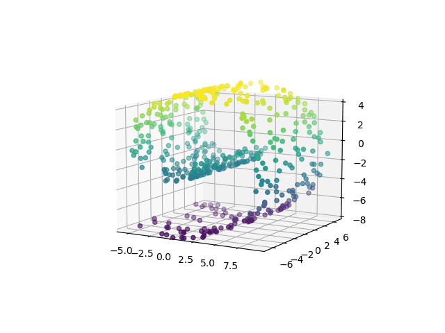

# Manifold Sculpting

This repository contains the code for the implementation of the method proposed by Michael Gashler in his paper: [Iterative Non-linear Dimensionality Reduction by Manifold Sculpting](https://proceedings.neurips.cc/paper/2007/hash/c06d06da9666a219db15cf575aff2824-Abstract.html). The method is exposed and compared with other manifold learning techniques, like Isomap, t-SNE, UMAP and LLE, in particular with respect to the results obtained on a simple Swiss Roll.

## Content 

The code which implements **Manifold Sculpting** method is available in *manifold_sculpt.py* and its use is shown in the corresponding noteboook, along with the comparisons with the other methods cited. 

All the code provided has been written using Python 3.9.5.

## Results

The very nice thing about manifold sculpting algorithm is that we can observe what is going on, stopping our algorithm at whatever point we desire and looking at 
partial results, in order to obtain a awesome unrolling of Swiss Roll.

